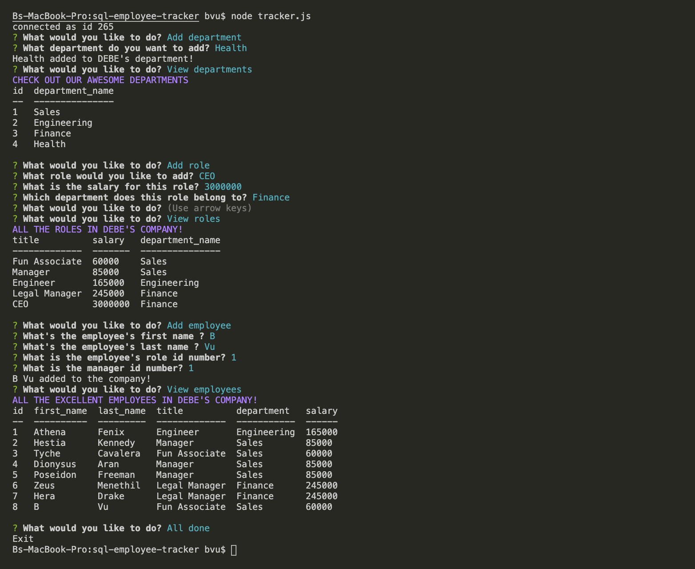

# sql-employee-tracker

 Using the MySQL dependency as the database and to take the inforamtion stored in the database to create an internal tool to view employee, role, and department data as well as add an employee, role, or department. 


## Site-video 
[Demo Video](https://drive.google.com/file/d/1sT1G3WIel3KBlnAU-rYMioZblzMNnNo_/view)  


# Table of Contents 
[Tittle](#sql-employee-tracker)

[Guide Video](#Guide-Video)

[Heroku](#Heroku-Deployed)

[Table of Contents](#Table-of-Content)

[Description of Page Building](#Description-of-Page-Building)

[Code Snippet](#Code-Snippet)

[Technologies Used](#Technologies-Used)

[Author](#Author)

[License](#License)


## Description of Page Building 
* In MYSQL 
  <ul> 
  <li> populate MySQL database with three tables for employee, role, and department.
  <li> Insert Seeds file, which are value into tables such as names, id, title, salaries. 
  <li> Select table and create database in workbench
  </li>
  </ul>


* IN javascript file 
  <ul> 
  <li> nmp install to download packages and dependencies 
  <li> add MySQL password to the server.js file to ensure that the connection to the database can be made and requests for actions can be pushed to the database
  <li> create promts for user inputs
  <li> Use Lefjoin to join database tables 
  <li> Generate table's value and link user input to create more database 
  </li>
  </ul>
  


## Code Snippet

Install npm package 
npm install express

Required variables 
``` Javascript
const mysql = require(`mysql`);
const inquirer = require("inquirer");
const cTable = require("console.table");
```
Sets up connection 
``` Javascript
const connection = mysql.createConnection({
  host: "localhost",
  port: 3306,
  user: "root",
  password: "password",
  database: "my_employees"
});
```

Using LEFT JOIN to join two tables with the same ID 
``` Javascript
function viewEmployees() {
  console.log(chalk.magentaBright(`ALL THE EXCELLENT EMPLOYEES IN DEBE'S COMPANY!`));
  var allEQuery =
    "SELECT employee.id, employee.first_name, employee.last_name, role.title, department.department_name AS department, role.salary FROM employee LEFT JOIN role ON employee.role_id = role.id LEFT JOIN department ON role.department_id = department.id;";
  connection.query(allEQuery, function (err, response) {
    console.table(response);
    mainPrompt();
  });
}
```


## Technologies Used
- Node - an open-source, cross-platform, back-end JavaScript runtime environment that executes JavaScript code outside a web browser.
  * [Node.js](https://nodejs.org/dist/latest-v14.x/docs/api/)
-  Inquier - NPM package to interact with the user via the command-line.
  * [Inquier] (https://www.npmjs.com/package/inquirer/v/0.2.3)
- NPM package to connect to your MySQL database and perform queries.
  * [Git](https://www.npmjs.com/package/mysql)
- Git - version control system to track changes to source code
  * [Git](https://git-scm.com/)
- GitHub - hosts repository that can be deployed to GitHub Pages
  * [Github](https://github.com/)
  

## Author

* **B Tram Vu** 

- [Link to Portfolio Site](https://vubao2303.github.io/portfolio/)
- [Link to Github](https://github.com/vubao2303)
- [Link to LinkedIn](https://www.linkedin.com/in/tram-vu-866250121/)

## License

© 2021 Trilogy Education Services, a 2U, Inc. brand. All Rights Reserved.